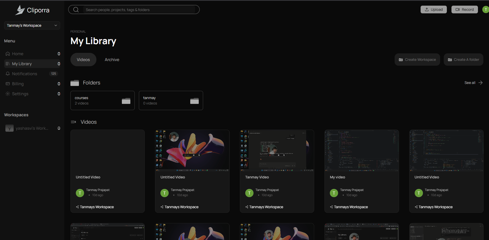
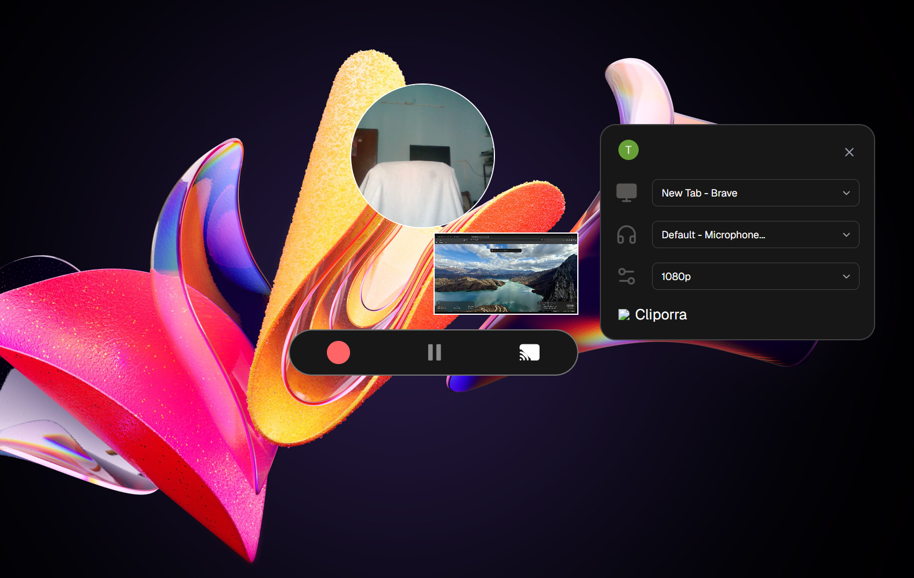

# 🎥 Cliporra — Async Video Recording & Sharing SaaS

Cliporra is a SaaS platform built for teams and creators who are tired of scheduling calls to explain something a 2-minute video could show. It combines a native desktop recorder, AI-powered transcription, and a collaborative cloud workspace into a single seamless pipeline — record once, and let AI and your team do the rest.

---

## 🚩 Problem Statement

Modern teams default to synchronous meetings even when they aren't necessary — a quick screen-share call to explain a bug, walk through a design, or onboard a new teammate.

Existing screen recording tools tend to fall into one of two camps:
- **Too basic** — record and export a raw video file with no transcription, no organization, and no way for a team to discuss it in context.
- **Too disconnected** — recordings live in one tool, transcripts in another, and team chat in a third, with no single place that ties a video to its context, its summary, and its conversation.

This creates friction:
- Recipients have to watch the entire video to extract the one relevant moment.
- Teams lose context once a video is buried in a shared drive.
- There's no lightweight way to know *who* actually watched what you sent.

## ✅ Our Solution

Cliporra turns a screen recording into a structured, searchable, and shareable piece of team knowledge — automatically.

The platform allows users to:

### 🔹 Record Natively, Anywhere
A cross-platform Electron desktop app captures screen, webcam, and microphone simultaneously, with a dedicated recording **studio** window and a floating **webcam** overlay — no browser tab required.

### 🔹 Get AI-Generated Context Instantly
Every recording is automatically transcribed with **OpenAI Whisper**, then summarized into a clean **title and description** with GPT — so nobody has to write their own video notes.

### 🔹 Organize Work Into Workspaces
Videos live inside **Workspaces** (`PUBLIC` or `PERSONAL`) and folders, with role-based invitations so teams can keep client work, internal docs, and personal recordings cleanly separated.

### 🔹 Collaborate Directly on the Video
Threaded **comments and replies** let teams discuss a specific video in context instead of starting a new Slack thread, with rich shareable links for anyone outside the workspace.

### 🔹 Know When It's Watched
Real-time, **Socket.io**-powered notifications tell you the moment someone opens your video — so follow-ups happen while it's still top of mind.

---

## 📸 Screenshots

**1. Dashboard / Workspace View**
All recordings, organized by workspace and folder, with AI-generated titles.

**2. Recording Studio**
The Electron desktop app mid-recording, with screen + webcam capture active.

**3. Video Playback & Comments**
Shareable video page with transcript, AI summary, and threaded comments.

---

## 🛠️ Tech Stack

- **Web Framework:** Next.js 15 (App Router)
- **Desktop App:** Electron, `electron-vite` (dev), `electron-package-manager` (packaging)
- **Backend:** Express.js + Socket.io
- **Authentication:** Clerk
- **Database:** PostgreSQL with Prisma ORM
- **Storage/CDN:** AWS S3 + CloudFront (custom `VideoStreamingPolicy` for `Range`-header video seeking)
- **AI:** OpenAI (Whisper transcription + GPT summaries)
- **Payments:** PayPal (UPI-supported subscriptions)
- **State Management:** TanStack Query + Redux Toolkit
- **Styling:** Tailwind CSS & shadcn/ui
- **Email:** Nodemailer
- **Deployment:** Vercel (web), Railway (server), GitHub Releases (desktop)

Users on the free tier can record and share within personal workspaces; an active PayPal subscription unlocks team workspaces, extended cloud storage, and unlimited AI transcriptions.

---

## 📊 Engagement & Organization

Cliporra automatically tracks, per video:
- View count and viewer identity (within a workspace)
- Comment activity
- Processing status (uploading → transcribing → ready)

## 🎬 Multi-Window Recording Architecture

The desktop app isn't a single window — it's three coordinated Electron windows (main app, recording studio, webcam overlay), each with its own Vite entry point, so the recording UI never blocks the rest of the app.

## ⚡ Real-Time Notifications

Socket.io pushes live events to the web app the instant something happens — a new comment, a workspace invite accepted, or a teammate viewing a shared video — without polling.

## 🔍 Searchable, AI-Summarized Transcripts

Because every video is transcribed on upload, users can search across the *content* of their recordings, not just filenames or manually-written titles.

---

## 🔗 Links

